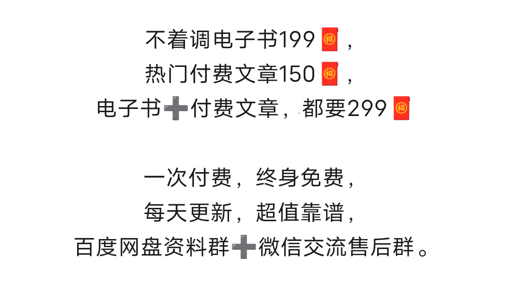

    

<h1 align="center">蜕变在八小时外</h1>

    人与人的差别就是一种人的思想境界差别，一种人非常爱学习，不断的努力学习各种能力，所以容易成功。一种人反对学习，认为学习无用，这样的人只能成为普通人，社会上最底层的人。

    
↓ -- 内容目录 -- ↓

  

[1、不着调电子书](https://github.com/DuncanPlayer/Rokuro#)

    

[2、热门付费文章](https://github.com/DuncanPlayer/Rokuro#)

    

[3、价格](https://github.com/DuncanPlayer/Rokuro#)

    

[2、注意事项](https://github.com/DuncanPlayer/Rokuro#)

虚拟产品，物超所值，自愿购买，概不退费。

办理会员，联系微信hhhhhh00000yy

    

